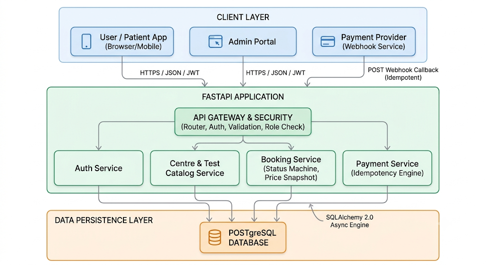
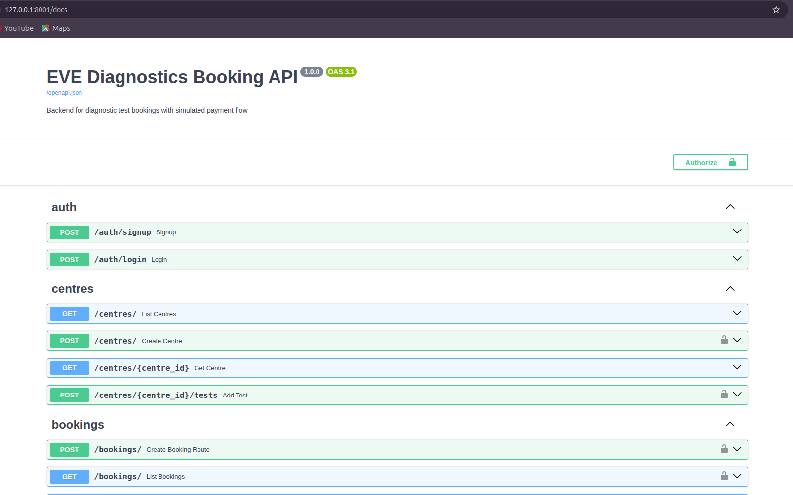
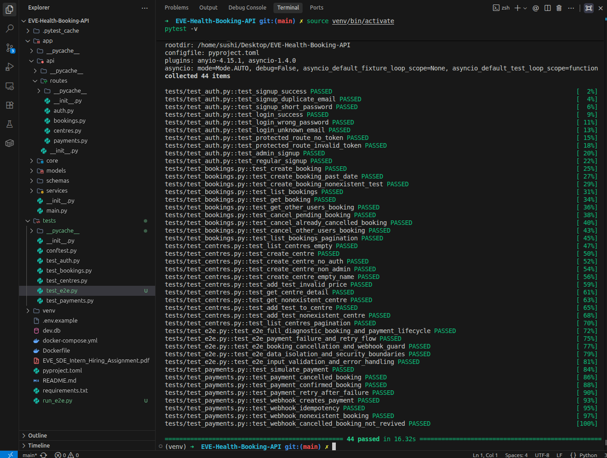
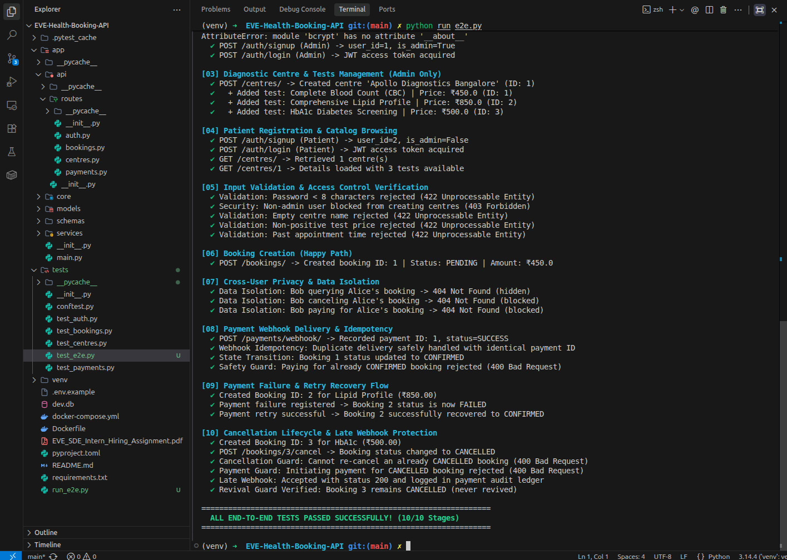

# EVE Healthcare — Diagnostic Booking & Simulated Payment API

> **SDE Intern Backend Engineering Assignment**  
> A clean, production-ready asynchronous backend service for diagnostic test bookings with a simulated payment flow and idempotent webhook handling.

---

## 📌 Project Overview

This service manages the complete lifecycle of diagnostic healthcare bookings:
1. **User Authentication**: Secure signup and login with password hashing and JWT access tokens.
2. **Diagnostic Centres & Tests**: Catalog APIs for centres and test packages with price and location.
3. **Booking System**: Appointment booking with validation, status tracking (`PENDING`, `CONFIRMED`, `CANCELLED`, `FAILED`), and user data isolation.
4. **Simulated Payments & Webhook**: Mock payment simulation and an idempotent webhook callback that prevents duplicate processing and state corruption.

---

## 🛠️ Tech Stack

| Component | Technology | Description |
|---|---|---|
| **Framework** | **FastAPI** (Python 3.11+) | Asynchronous web framework with native OpenAPI docs |
| **Database** | **PostgreSQL** & **SQLite** | Asynchronous ORM via **SQLAlchemy 2.0** (`asyncpg` / `aiosqlite`) |
| **Validation** | **Pydantic v2** | Strict schema validation for requests and responses |
| **Security** | **JWT & Bcrypt** | `python-jose` for token generation and `passlib` for password hashing |
| **Testing** | **Pytest & HTTPX** | Async test suite with in-memory database and E2E verification |
| **Container** | **Docker & Docker Compose** | Multi-container setup for one-command execution |

---

## 🏛️ System Architecture (High-Level Design)

The system is designed with a layered architecture separating concerns across API routing, business services, and database persistence:



- **Client Layer**: Patients, Administrators, and external Payment Providers.
- **API Gateway & Security**: Request validation, JWT authentication, and role authorization.
- **Service Layer**: Decoupled business logic (`AuthService`, `CentreService`, `BookingService`, `PaymentService`).
- **Persistence Layer**: Async PostgreSQL / SQLite database with unified models and relational constraints.

---

## 📖 Interactive Swagger API Documentation

FastAPI automatically generates interactive OpenAPI documentation accessible via your browser:



*Open Swagger at: `http://localhost:8001/docs`*

---

## 🚀 How to Run Locally

### Option 1: Instant Local Run (Recommended — No Postgres/Docker Required)

A pre-configured [`.env`](file://.env) file is provided pointing to the local SQLite database (`dev.db`):

```bash
# 1. Activate virtual environment
source venv/bin/activate

# 2. Run the application (using port 8001 to avoid conflicts)
uvicorn app.main:app --reload --port 8001
```

Access the interactive API docs at **`http://localhost:8001/docs`**.

---

### Option 2: Run with Docker Compose (PostgreSQL)

```bash
docker compose up --build
```

The database container starts first, runs health checks, and the API initializes automatically.

---

## 🧪 How to Run Tests

The test suite runs entirely in-memory using `aiosqlite` without requiring external services.

```bash
# Run the full async test suite (44 passing tests)
source venv/bin/activate
pytest -v

# Run the live End-to-End lifecycle runner
python run_e2e.py
```

### Test Results

<p align="center">
  
  
</p>

- **Pytest Suite (`pytest -v`)**: 44 passing unit, integration, and security tests.
- **Live E2E Runner (`python run_e2e.py`)**: 10-stage sequential simulation of real user, admin, booking, webhook, and failure recovery flows.

---

## 📡 API Endpoints & Examples (As Per Assignment)

### 1. Authentication
- `POST /auth/signup` — Create user account (`is_admin=True` if email matches `ADMIN_EMAIL`)
- `POST /auth/login` — Authenticate and receive JWT bearer token

```bash
# Sign up
curl -X POST http://localhost:8001/auth/signup \
  -H "Content-Type: application/json" \
  -d '{"email": "patient@example.com", "password": "securepassword123"}'

# Log in
curl -X POST http://localhost:8001/auth/login \
  -d "username=patient@example.com&password=securepassword123"
```

---

### 2. Diagnostic Centres & Tests
- `GET /centres/` — List diagnostic centres (paginated: `skip`, `limit`)
- `GET /centres/{centre_id}` — Get centre detail with available diagnostic tests
- `POST /centres/` — Create diagnostic centre (*Admin only*)
- `POST /centres/{centre_id}/tests` — Add test with price to centre (*Admin only*)

```bash
# Browse centres
curl http://localhost:8001/centres/

# View centre detail with tests
curl http://localhost:8001/centres/1

# Create centre (Admin token required)
curl -X POST http://localhost:8001/centres/ \
  -H "Authorization: Bearer <ADMIN_TOKEN>" \
  -H "Content-Type: application/json" \
  -d '{"name": "Apollo Diagnostics", "location": "Bangalore"}'

# Add test to centre (Admin token required)
curl -X POST http://localhost:8001/centres/1/tests \
  -H "Authorization: Bearer <ADMIN_TOKEN>" \
  -H "Content-Type: application/json" \
  -d '{"name": "Complete Blood Count (CBC)", "price": 499.00}'
```

---

### 3. Booking System
- `POST /bookings/` — Book a test (status defaults to `PENDING`, amount pulled from test price)
- `GET /bookings/` — List current user's bookings (user data isolation enforced)
- `GET /bookings/{booking_id}` — View single booking details
- `POST /bookings/{booking_id}/cancel` — Cancel a pending or confirmed booking

```bash
# Create booking (Appointment must be in future)
curl -X POST http://localhost:8001/bookings/ \
  -H "Authorization: Bearer <PATIENT_TOKEN>" \
  -H "Content-Type: application/json" \
  -d '{"centre_id": 1, "test_id": 1, "appointment_time": "2099-10-15T09:30:00Z"}'

# List user bookings
curl http://localhost:8001/bookings/ \
  -H "Authorization: Bearer <PATIENT_TOKEN>"

# Cancel booking
curl -X POST http://localhost:8001/bookings/1/cancel \
  -H "Authorization: Bearer <PATIENT_TOKEN>"
```

---

### 4. Simulated Payments & Webhook
- `POST /payments/` — Simulate payment processing (results in `SUCCESS` or `FAILED`)
- `POST /payments/webhook/` — Idempotent webhook callback from simulated payment provider

```bash
# Simulate payment
curl -X POST http://localhost:8001/payments/ \
  -H "Authorization: Bearer <PATIENT_TOKEN>" \
  -H "Content-Type: application/json" \
  -d '{"booking_id": 1}'

# Webhook callback (Idempotent by event_id)
curl -X POST http://localhost:8001/payments/webhook/ \
  -H "Content-Type: application/json" \
  -d '{"event_id": "evt-payment-101", "booking_id": 1, "status": "SUCCESS"}'
```

---

## 🛡️ Edge Cases Handled

| Edge Case | Implementation & Behavior |
|---|---|
| **Webhook Idempotency** | Webhooks are keyed by `event_id`. Duplicate webhook deliveries return the existing payment record (`200 OK`) without double-updating booking status or corrupting data. |
| **No-Revival Guard** | If a booking is `CANCELLED`, a late `SUCCESS` webhook creates the payment entry for audit records, but **never revives** the booking back to `CONFIRMED`. |
| **Double Payment Prevention** | Calling `/payments/` on an already `CONFIRMED` booking is blocked with `400 Bad Request`. |
| **Payment Failure & Retry** | A `FAILED` booking can be retried via the payment endpoint; once a successful payment arrives, status transitions to `CONFIRMED`. |
| **User Data Isolation** | Patients can only view and cancel their own bookings. Accessing another user's booking ID returns `404 Not Found`. |
| **Input Validation** | Booking appointments in the past returns `422`. Passwords under 8 characters, empty centre names, and non-positive prices (`<= 0`) are rejected at schema level. |
| **Admin Authorization** | Regular users attempting to create centres or add tests receive `403 Forbidden`. |

---

## 🗄️ Database Schema Design

```text
users
├── id (PK, Integer)
├── email (String, Unique, Indexed)
├── hashed_password (String)
├── is_admin (Boolean, Default: False)
└── created_at (DateTime, UTC)

centres
├── id (PK, Integer)
├── name (String, min_length=1)
├── location (String)
└── created_at (DateTime, UTC)

tests
├── id (PK, Integer)
├── centre_id (FK -> centres.id)
├── name (String, min_length=1)
├── price (Float, gt=0)
└── created_at (DateTime, UTC)

bookings
├── id (PK, Integer)
├── user_id (FK -> users.id)
├── centre_id (FK -> centres.id)
├── test_id (FK -> tests.id)
├── appointment_time (DateTime, UTC)
├── amount (Float, Snapshotted from test.price)
├── status (String: PENDING | CONFIRMED | CANCELLED | FAILED)
└── created_at (DateTime, UTC)

payments
├── id (PK, Integer)
├── booking_id (FK -> bookings.id)
├── event_id (String, Unique, Indexed)
├── status (String: SUCCESS | FAILED)
└── created_at (DateTime, UTC)
```

---

## 💡 Important Assumptions

1. **Price Integrity**: Booking amount is determined by the server snapshotting `test.price` at creation time, preventing client-side price tampering.
2. **Admin Configuration**: The initial system administrator is determined by matching the registered email against the `ADMIN_EMAIL` environment variable.
3. **Audit Trail**: Payments received for cancelled bookings are preserved in the `payments` table for financial accounting and dispute resolution.

---

## 🔮 What I Would Improve With More Time

1. **Alembic Database Migrations**: Add formal schema migration version control instead of `create_all`.
2. **Redis Caching**: Cache diagnostic centres and test catalogs (`GET /centres/`) with cache invalidation on admin updates.
3. **Webhook Signature Verification**: Add HMAC-SHA256 signature verification to ensure webhooks genuinely originate from the payment provider.
4. **Rate Limiting**: Protect authentication and payment simulation endpoints against brute force using Redis token buckets.
